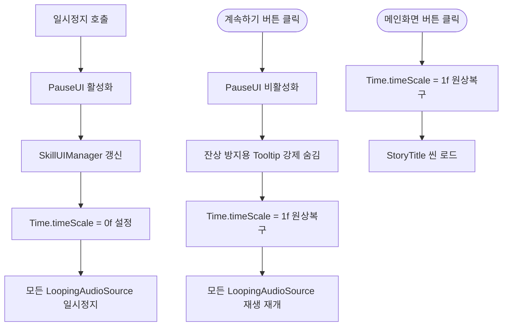

# 🛠 트리플서바이버: 인게임 일시정지 및 상태 관리 시스템 (Pause System)

## 1. 시스템 개요 (Overview)
게임 플레이 중 일시정지(Pause) 상태를 제어하고, 이와 연동되는 오디오, UI 툴팁, 씬 전환을 안전하게 관리하는 시스템입니다.
단순히 시간을 멈추는 것을 넘어, 일시정지 상태에서 발생할 수 있는 각종 사이드 이펙트(사운드 계속 재생, 툴팁 잔상, 씬 프리징)를 사전에 차단하는 디테일에 집중했습니다.

* **핵심 키워드:** `Time Management`, `Audio State Sync`, `UX Bug Prevention`, `Scene Management`

---

## 2. 핵심 아키텍처 및 제어 흐름 (Architecture)

일시정지 팝업이 열리고 닫힐 때, 게임 로직(`Time.timeScale`), 오디오(`AudioSource`), UI(`Tooltip`)의 상태를 중앙에서 완벽하게 동기화합니다.

### 📌 일시정지 상태 제어 흐름도

---

## 3. 주요 클래스 및 함수 명세 (Code Specification)

### 3.1 핵심 클래스: `PauseUI`
게임 내 일시정지 상태를 관장하며, 버튼 이벤트 리스너를 동적으로 할당하여 팝업과 게임 상태를 제어합니다.

### 3.2 주요 함수 (Methods)
* `OpenPausePopup()`
  * `Time.timeScale = 0f`를 적용하여 물리 연산 및 업데이트를 정지시킵니다.
  * 루프형 사운드(예: 발소리, 환경음)가 일시정지 중에도 계속 재생되는 버그를 막기 위해, `LoopingAudioSource`를 찾아 `source.Pause()`를 명시적으로 호출합니다.
* `ClosePausePopup()`
  * UI를 닫음과 동시에 `TooltipTrigger.HideTooltip()`을 강제 호출하여, 팝업이 닫힐 때 툴팁이 허공에 남는 UX(사용자 경험) 저하 버그를 차단했습니다.
  * `Time.timeScale = 1f`로 복구하고, 멈췄던 오디오를 `source.UnPause()`로 재개합니다.
* `GoToMainScene()`
  * 씬을 전환하는 로직입니다.

---

## 4. 트러블슈팅 및 기술적 디테일 (Technical Highlights)

* **🔴 씬 전환 프리징(Freezing) 버그 차단:** 
  * `Time.timeScale = 0f` 상태에서 곧바로 메인 씬으로 전환하면 다음 씬의 애니메이션과 물리 연산이 멈춘 채로 로드되는 치명적인 버그가 발생합니다.
  * 이를 방지하기 위해 `SceneManager.LoadScene()` 호출 직전에 반드시 **`Time.timeScale = 1f`로 초기화**하는 안전장치를 추가했습니다.
* **🔴 루프 사운드(Looping Audio) 예외 처리:** 
  * `Time.timeScale`을 0으로 만들어도 오디오 컴포넌트는 영향을 받지 않고 계속 재생되는 문제를 발견했습니다.
  * `FindObjectsByType`을 활용해 씬 내의 켜져 있는 반복 사운드 객체를 추적하고, 게임 일시정지 상태와 오디오의 재생 상태를 완벽하게 동기화(Sync)하여 플레이어의 몰입을 깨지 않도록 개선했습니다.
