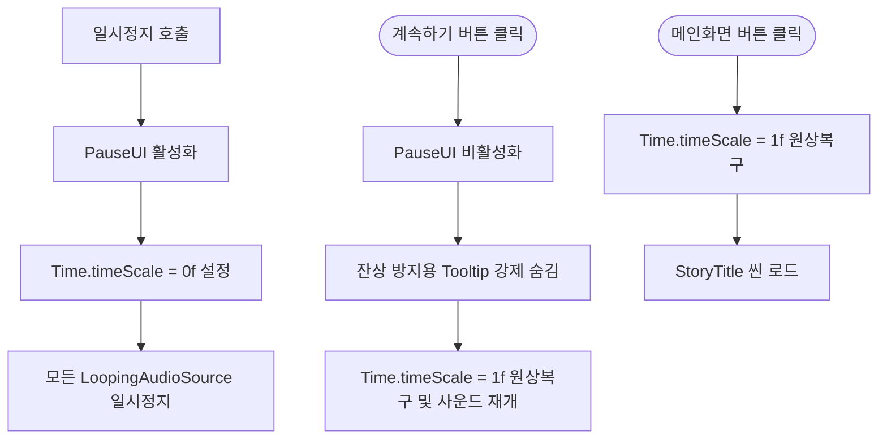

#  인게임 일시정지 및 상태 관리 시스템 (Pause System)

## 1. 시스템 개요 (Overview)
게임 플레이 중 일시정지(Pause) 상태를 제어하고, 이와 연동되는 오디오, UI 툴팁, 씬 전환을 안전하게 관리하는 시스템입니다.
단순히 시간을 멈추는 것을 넘어, 일시정지 상태에서 발생할 수 있는 각종 사이드 이펙트(사운드 계속 재생, 툴팁 잔상, 씬 프리징)를 사전에 차단하는 디테일에 집중했습니다.

* **핵심 키워드:** `Time Management`, `Audio State Sync`, `UX Bug Prevention`, `Scene Management`

---

## 2. 상태 제어 아키텍처 (Architecture)

일시정지 팝업이 열리고 닫힐 때, 게임 로직(`Time.timeScale`), 오디오(`AudioSource`), UI(`Tooltip`)의 상태를 중앙에서 동기화합니다.



---

## 3. 핵심 기능 구현 및 코드 발췌 (Key Features & Code)

### 3.1 씬 전환 프리징(Freezing) 방지 로직
`Time.timeScale = 0f` 상태에서 메인 씬으로 전환하면 다음 씬의 물리 연산이 멈춘 채로 로드되는 치명적인 버그가 발생합니다. 이를 막기 위해 씬 로드 직전에 시간을 강제 초기화합니다.

```csharp
void GoToMainScene()
{
    // 씬을 이동하기 전에는 반드시 Time.timeScale을 1로 되돌려야 합니다.
    // 그렇지 않으면 다음 씬이 멈춘 상태로 로드될 수 있습니다.
    Time.timeScale = 1f;
    SceneManager.LoadScene("StoryTitle"); 
}
```

### 3.2 오디오 상태 동기화 및 UI 잔상 처리
시간을 멈춰도 루프형 오디오 컴포넌트는 계속 재생되는 문제를 해결하기 위해, 씬 내의 켜져 있는 반복 사운드 객체를 추적하여 명시적으로 제어(`Pause`, `UnPause`)했습니다. 또한 팝업이 닫힐 때 툴팁이 허공에 남는 UX 저하를 차단했습니다.

```csharp
public void OpenPausePopup()
{
    gameObject.SetActive(true);
    Time.timeScale = 0f;

    // 씬에 있는 모든 루프 사운드를 찾아서 '일시정지'
    var loopingSfxList = Object.FindObjectsByType<LoopingAudioSource>(FindObjectsSortMode.None);
    foreach (var sfx in loopingSfxList)
    {
        AudioSource source = sfx.GetComponent<AudioSource>();
        if (source != null && source.isPlaying) source.Pause();
    }
}

void ClosePausePopup()
{
    gameObject.SetActive(false);

    // 팝업이 닫힐 때 툴팁을 강제로 숨겨 잔상 버그 방지
    TooltipTrigger.HideTooltip();

    Time.timeScale = 1f;

    // 씬에 있는 모든 루프 사운드 '다시 재생'
    var loopingSfxList = Object.FindObjectsByType<LoopingAudioSource>(FindObjectsSortMode.None);
    foreach (var sfx in loopingSfxList)
    {
        AudioSource source = sfx.GetComponent<AudioSource>();
        if (source != null) source.UnPause();
    }
}
```

>  [PauseUI.cs 전체 코드 보기](./cs_File/PauseUI.cs)
