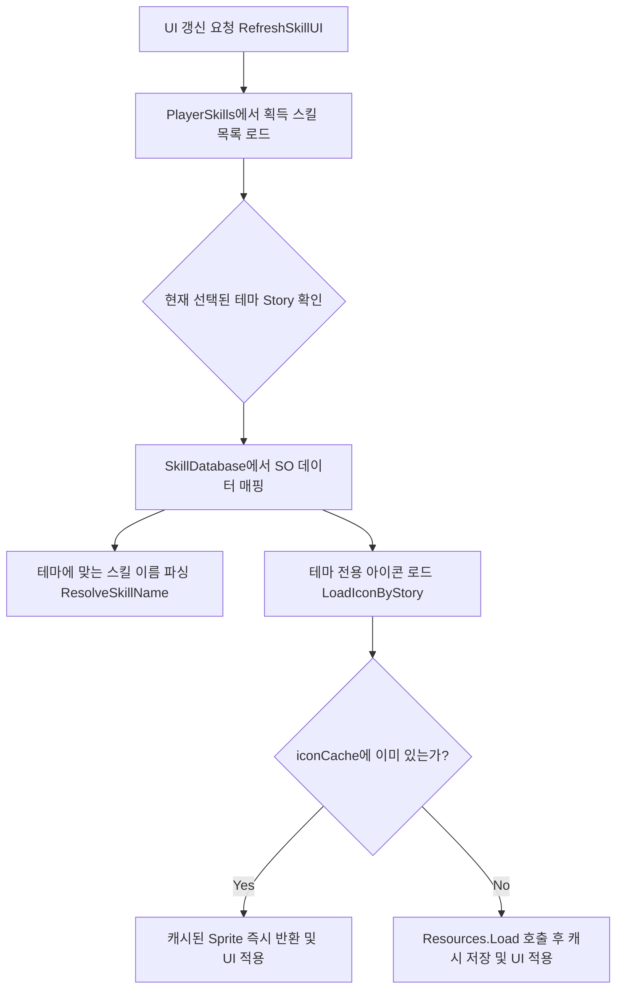

#  다중 테마 지원 스킬 UI 및 최적화 시스템 (Skill UI System)

## 1. 시스템 개요 (Overview)
플레이어가 획득한 액티브 및 패시브 스킬 목록을 UI에 시각적으로 매핑하는 시스템입니다. 
게임의 현재 진행 스토리(Animal, Fantasy, Alien 등)에 따라 **스킬의 이름과 아이콘이 동적으로 변화**하는 다중 테마(Multi-Theme) 구조를 지원하며, 딕셔너리를 활용한 **리소스 캐싱(Resource Caching)**으로 메모리 로드 부하를 최소화했습니다.

* **핵심 키워드:** `Dynamic Theming`, `Resource Caching`, `ScriptableObject Mapping`, `Memory Optimization`

---

## 2. 데이터 흐름 및 아키텍처 (Architecture)

스킬 UI가 갱신될 때마다 현재 게임의 테마(Story)를 확인하고, ScriptableObject(SO)에서 데이터를 파싱하여 UI에 캐싱된 리소스를 바인딩합니다.



---

## 3. 핵심 기능 구현 및 코드 발췌 (Key Features & Code)

### 3.1 다중 테마(Story) 기반 동적 네이밍 매핑
하나의 스킬 ID가 게임의 진행 상황(스토리 테마)에 따라 각기 다른 이름과 콘셉트를 가지도록 `StoryToNameIndex` 맵을 활용해 확장성 높은 구조를 구현했습니다.

```csharp
private string ResolveSkillName(SkillData activeSo, PassiveSkillData passiveSo, int skillID)
{
    // 액티브 스킬: 현재 게임의 스토리(테마)에 따라 동적으로 이름 변경
    if (activeSo != null)
    {
        // GameManager에서 현재 스토리 값을 가져와 보정 (0=Animal, 1=Fantasy, 2=Alien)
        int gmStory = Mathf.Clamp(GameManager.instance?.Story ?? 0, 0, 2);
        int nameIdx = StoryToNameIndex[gmStory]; 
        string storyKR = GetStoryKR_Active(activeSo, nameIdx);

        // 테마별 이름이 존재하면 반환, 없으면 기본 이름으로 폴백(Fallback) 처리
        if (!string.IsNullOrWhiteSpace(storyKR)) return storyKR;
        return activeSo.krName; 
    }
    // ... (패시브 로직 생략)
}
```

### 3.2 딕셔너리 기반 리소스 캐싱 최적화 (Icon Cache)
슬롯을 클릭하거나 UI를 갱신할 때마다 무거운 `Resources.Load`가 반복 호출되는 것을 방지하기 위해, 한 번 불러온 `Sprite`는 `Dictionary` 메모리에 저장하여 성능을 최적화했습니다.

```csharp
private Sprite LoadIconByStory(string iconKey, bool isPassive)
{
    string cacheKey = $"{basePath}/{iconKey}";
    
    // 1. 메모리에 이미 로드된 아이콘인지 캐시 딕셔너리 확인
    if (iconCache.TryGetValue(cacheKey, out var cached))
        return cached;

    // 2. 캐시에 없으면 Resources 폴더에서 동적 로드
    var sp = Resources.Load<Sprite>(cacheKey);
    
    // 3. 로드에 성공했다면 다음 렌더링을 위해 캐시에 저장 (메모리 최적화)
    if (sp != null)
    {
        iconCache[cacheKey] = sp;
    }
    return sp;
}
```

>  [SkillUIManager.cs 전체 코드 보기](./cs_file/SkillUIManager.cs)
