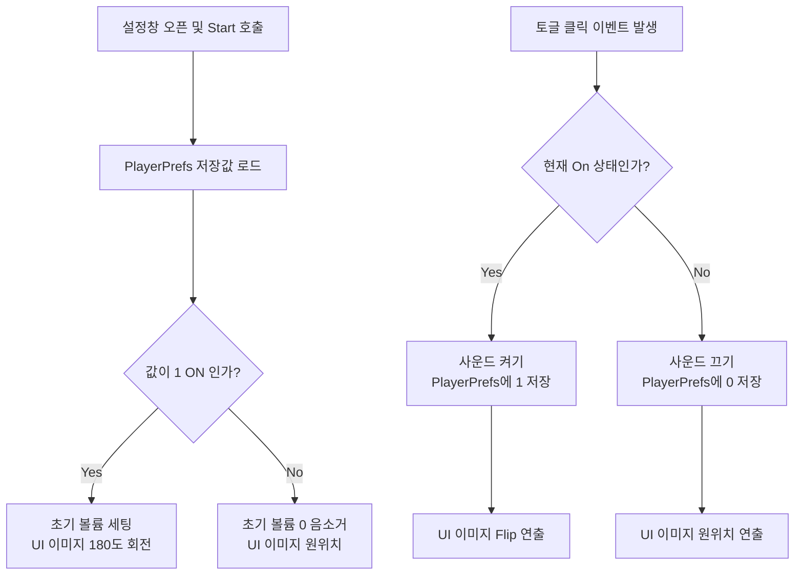

#  환경설정 및 사운드 제어 시스템 (Sound Options)

## 1. 시스템 개요 (Overview)
게임 내 배경음(BGM)과 효과음(SFX)을 켜고 끌 수 있는 환경설정 UI 컨트롤러입니다. 
플레이어가 설정한 옵션 값이 게임을 껐다 켜도 유지되도록 **데이터 영속성(Data Persistence)**을 보장하며, 싱글톤(Singleton) 패턴으로 구현된 사운드 매니저들과 통신하여 볼륨을 중앙 제어합니다.

* **핵심 키워드:** `PlayerPrefs`, `Event-Driven UI`, `Singleton Integration`, `UX Animation`

---

## 2. 상태 제어 아키텍처 (Architecture)

매 프레임 상태를 체크하는 `Update()` 함수의 낭비를 막기 위해 철저히 **이벤트 기반(Event-Driven)**으로 설계하여 성능을 최적화했습니다.



---

## 3. 핵심 기능 구현 및 코드 발췌 (Key Features & Code)

### 3.1 생명주기를 활용한 UI - 오디오 상태 동기화
인게임에서 사운드를 끄고 게임을 재시작했을 때, 실제 사운드는 안 나오지만 옵션 창의 UI 토글은 켜져 있는 '상태 불일치 버그'를 방지하기 위한 초기화 로직입니다.

```csharp
private void Start()
{
    // PlayerPrefs를 활용한 로컬 저장 데이터 불러오기 (기본값 ON 설정으로 예외 방지)
    bool bgmOn = PlayerPrefs.GetInt("BGM_ON", 1) == 1;
    bool sfxOn = PlayerPrefs.GetInt("SFX_ON", 1) == 1;

    // UI 토글 상태 및 실제 볼륨 강제 동기화
    bgmToggle.isOn = bgmOn;
    BgmSoundManager.Instance.SetVolume(bgmOn ? 0.5f : 0f);

    // 상태에 따른 UI 이미지 직관적 피드백 (Y축 180도 회전)
    bgm.transform.rotation = Quaternion.Euler(0f, bgmOn ? 180f : 0f, 0f);

    // Update() 대신 리스너를 동적 할당하여 이벤트 기반 최적화
    bgmToggle.onValueChanged.AddListener(OnBgmToggleChanged);
}
```

### 3.2 이벤트 기반 사운드 토글 제어
토글 값이 변경될 때마다 볼륨 조절, UI 회전 연출, 로컬 데이터 저장이 동시에 처리됩니다.

```csharp
private void OnBgmToggleChanged(bool isOn)
{
    // Y축 회전값을 통한 스위치 ON/OFF 시각 연출
    float yRotation = isOn ? 180f : 0f;
    bgm.transform.rotation = Quaternion.Euler(0f, yRotation, 0f);
    
    BgmSoundManager.Instance.SetVolume(isOn ? 0.3f : 0f);
    PlayerPrefs.SetInt("BGM_ON", isOn ? 1 : 0);
}
```

>  [SoundOptionsController.cs 전체 코드 보기](./cs_File/SoundOptionsController.cs)
