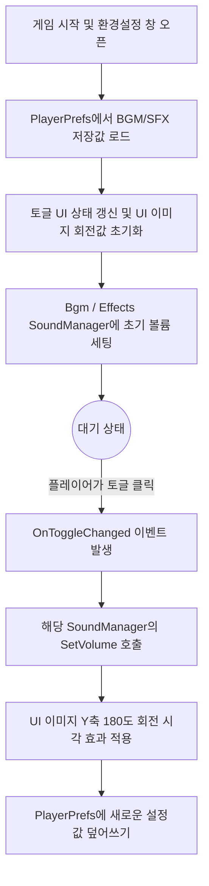

# 🛠 트리플서바이버: 환경설정 및 사운드 제어 UI (Sound Options)

## 1. 시스템 개요 (Overview)
게임 내 배경음(BGM)과 효과음(SFX)을 켜고 끌 수 있는 환경설정 UI 컨트롤러입니다. 
플레이어가 설정한 옵션 값이 게임을 껐다 켜도 유지되도록 **데이터 영속성(Data Persistence)**을 보장하며, 싱글톤(Singleton) 패턴으로 구현된 사운드 매니저들과 통신하여 볼륨을 중앙 제어합니다.

* **담당 역할:** 설정 UI 로직 구현, 로컬 데이터 저장 연동, UI 시각적 피드백(Flip) 적용
* **핵심 키워드:** `PlayerPrefs`, `Event-Driven UI`, `Singleton Integration`

---

## 2. 핵심 아키텍처 및 흐름 (Architecture)

본 시스템은 매 프레임 상태를 체크하는 낭비를 막기 위해 철저히 **이벤트 기반(Event-Driven)**으로 설계되었습니다.

1. **데이터 로드 (초기화):** 게임이 시작될 때(`Start`), 로컬 디바이스에 저장된 `PlayerPrefs` 값을 읽어와 이전 플레이 세션의 사운드 설정 상태를 복원합니다.
2. **동적 리스너 할당:** 인스펙터 창에서 버튼 이벤트를 연결하는 대신, 스크립트 내부에서 `AddListener`를 통해 토글(Toggle) 이벤트를 동적으로 연결하여 휴먼 에러를 방지했습니다.
3. **상태 동기화:** 토글 값이 변경될 때마다 1) 싱글톤 사운드 매니저의 실제 볼륨 조절, 2) UI 이미지의 3D 회전(Flip) 애니메이션, 3) 변경된 설정의 로컬 저장이 동시에 이루어집니다.

### 📌 환경설정 초기화 및 제어 흐름도

---

## 3. 클래스 및 주요 함수 명세 (Code Specification)

### 3.1 핵심 클래스: `SoundOptionsController`
UI 토글(Toggle) 요소와 실제 오디오를 재생하는 사운드 매니저 사이의 브릿지(Bridge) 역할을 수행하는 컨트롤러입니다.

### 3.2 주요 함수 (Methods)
* `Start()`
  * `PlayerPrefs.GetInt`를 통해 저장된 값을 불러오며, 값이 없을 경우를 대비해 기본값(1, ON)을 설정하여 예외를 방지했습니다.
  * `bgm.transform.rotation = Quaternion.Euler(...)` 구문을 사용해 사운드가 켜져 있을 때와 꺼져 있을 때 UI 이미지의 Y축을 180도 뒤집어 직관적인 시각 피드백을 제공합니다.
* `OnBgmToggleChanged(bool isOn)` / `OnSfxToggleChanged(bool isOn)`
  * 토글 상태가 변할 때만 호출되는 콜백 함수입니다. 
  * 매 프레임 입력을 검사하는 `Update()` 함수를 사용하지 않고 옵저버 패턴 형태의 리스너를 사용하여 CPU 연산 낭비를 최적화했습니다.

---

## 4. 트러블슈팅 및 기술적 의사결정 (Troubleshooting)

### 🔴 문제 상황: UI 상태와 실제 사운드의 불일치 (Desync)
초기 구현 시, 인게임에서 사운드를 끄고 게임을 재시작했을 때 실제 사운드는 안 나오지만 옵션 창의 UI 토글은 'ON'으로 켜져 있는 **상태 불일치(Desync) 버그**가 발생했습니다.

### 🟡 해결 과정: AI 협업 및 생명주기(Lifecycle) 동기화
* 로컬 데이터 저장 방식에 대해 대형 언어 모델과 문답하며, 유니티의 `PlayerPrefs`를 활용한 경량 데이터 저장 기법을 학습하고 적용했습니다.
* 스크립트의 `Start()` 생명주기에서 UI의 시각적 상태(Toggle.isOn 및 Image Rotation)와 `SoundManager`의 실제 볼륨 수치를 `PlayerPrefs`의 값으로 **강제 동기화**하는 초기화 로직을 구축하여 불일치 문제를 해결했습니다.

### 🟢 결과: 안정적이고 최적화된 옵션 제어
* 게임을 재시작해도 플레이어의 마지막 설정이 완벽하게 유지됩니다.
* 인스펙터 하드코딩을 최소화하고 코드로 이벤트를 제어(`AddListener`)하여, 추후 조이스틱(Joystick) 설정 등 새로운 옵션이 추가되더라도 쉽게 확장할 수 있는 구조를 갖추었습니다.
