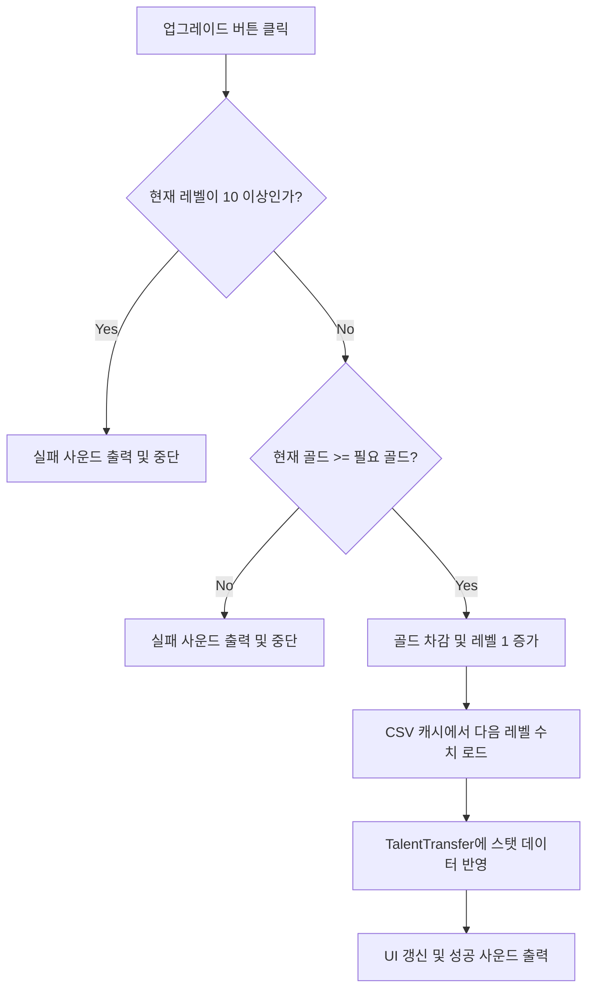

#  데이터 주도 기반 재능 업그레이드 시스템 (Talent System)

## 1. 시스템 개요 (Overview)
기획 데이터(CSV)와 인게임 로직을 완벽하게 분리하는 것을 목표로 설계된 스탯 업그레이드 시스템입니다. 
데이터를 메모리에 캐싱하여 LINQ 쿼리를 통해 UI에 즉각 바인딩하며, 재화 소모 및 스탯 상승을 안전하게 검증하는 트랜잭션 구조를 갖추고 있습니다.

* **핵심 키워드:** `Data-Driven Design`, `CSV Parsing`, `LINQ`, `Validation Logic`

---

## 2. 핵심 아키텍처 및 흐름 (Architecture)



---

## 3. 핵심 기능 구현 및 코드 발췌 (Key Features & Code)

### 3.1 안전한 업그레이드 트랜잭션 (Validation Logic)
단순히 수치만 올리는 것이 아니라, 최대 레벨 초과 여부와 현재 소지 골드를 사전에 검증하여 논리적 오류를 원천 차단합니다.

```csharp
public void TryUpgradeTalent(string talentId)
{
    // 1. 최대 레벨 도달 검증
    if (currentLevel >= 10) 
    {
        PlayErrorSound();
        return; 
    }

    // 2. 필요 재화(Cost) 검증
    int requiredGold = GetCostFromCSV(talentId, currentLevel);
    if (PlayerManager.CurrentGold < requiredGold) 
    {
        PlayErrorSound();
        return;
    }

    // 3. 재화 차감 및 레벨 증가 적용
    PlayerManager.CurrentGold -= requiredGold;
    currentLevel++;
    
    // 4. 상승된 스탯 반영 및 UI 갱신
    ApplyTalentStat(talentId, currentLevel);
    RefreshTalentUI();
    PlaySuccessSound();
}
```

### 3.2 엑셀(CSV) 연동 데이터 구조 (Data Format)
실제 밸런싱 작업에 사용된 `TalentTable.csv`의 데이터 포맷 예시입니다. 
유니티 Rich Text 태그(`<color>`)를 포함한 설명 텍스트를 통째로 관리하여 코드 수정 없이도 UI 디자인 연동이 가능하도록 설계했습니다.

| file (재능 ID) | level (레벨) | value (누적 증가치) | desc (설명 텍스트) | cost (필요 재화) |
| :--- | :--- | :--- | :--- | :--- |
| talent_attack_power | 0 | 0 | `<color=#ff0000>공격력</color>이 증가합니다.` | 100 |
| talent_attack_power | 1 | 6 | `<color=#ff0000>공격력</color>이 증가합니다.` | 200 |

>  [TalentUIManager.cs 전체 코드 보기](./Scripts/TalentUIManager.cs) 
